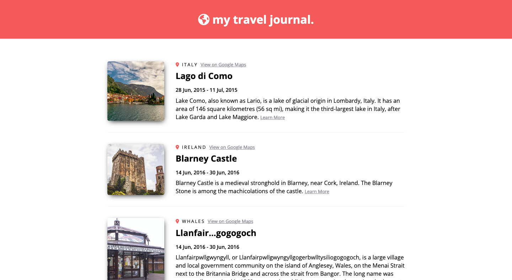

# Travel Journal

My solution to the 'Travel Journal' solo project from Module 11 (React Basics) of [Scrimba.com's Frontend Career Path](https://scrimba.com/learn/frontend/).

## Contents 

- [Overview](#overview)
- [My Process](#my-process)
  - [Built with](#built-with)
- [Screenshot](#screenshot)
- [Status: WORK-IN-PROGRESS](#status)
- [Connect](#connect)

## Overivew

This project is created with React as part of the coursework for Scrimba.com's Frontend Career path. It makes use of the `.map()` method and uses `prop` to pass properties down from imported data to the components.

Requirements: 

- Follow the [Figma design](https://www.figma.com/file/QG4cOExkdbIbhSfWJhs2gs/Travel-Journal?type=design&node-id=0-1&t=XIMkRnsOXiu0lB3z-0) specfications
- Use a data array in a separate .js file
- Use `.map()` and `props`

## My Process

### Built with

- HTML
- CSS
- JavaScript
- React

## Screenshot

## Status

A live version of this project can be viewed at: https://travel-journal-5d0577.netlify.app/. 

## Connect

Thank you for reading about this project. If you'd like to connect with me for mentoring, collaboration, or employment opportunities, you can do so via the following links:

- [Email](mailto:msg.for.anthony.p6ht3@simplelogin.com)
- [LinkedIn](https://linkedin.com/in/anthonynanfito)
- [Portfolio](https://ananfito.github.io)
- [Blog](https://ananfito.hashnode.dev)
